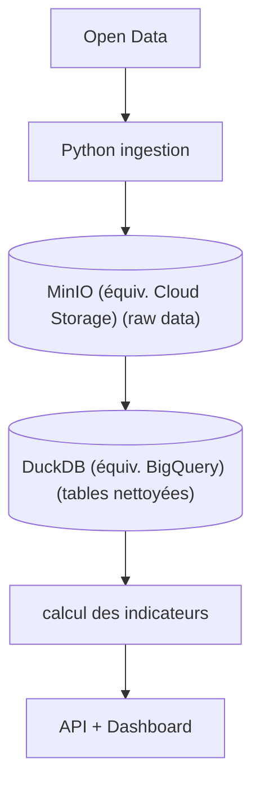

# 🏔️ Briançon Sustainable Tourism Observatory (BSTO)

> **Un pipeline de données dédié à l'analyse et à la promotion du tourisme durable dans la région de Briançon.**

Ce projet collecte, transforme et stocke des données liées aux flux touristiques, à l'impact environnemental et à l'économie locale pour aider à la prise de décision.

## 📽️ Vision : tourisme à capacité contrôlée (carrying capacity)
Créer une **plateforme publique de données territoriales** qui permet :
1. à la **mairie** de suivre la pression touristique
2. aux **habitants** de comprendre l'impact du toursime
3. aux **investisseurs touristiques** (gites, auberges, camping, etc.) de choisir des zones **sous-offertes**
4. de **répartir les flux touristiques** sans dépasser la capacité locale.

### Impact pour la mairie
#### décision publique
* limiter Airbnb dans les zones saturées
* encourager le toursime dans les villages voisins
  
#### urbanisme
* réguler les permis toursitiques
  
#### transition écologique
  * réduire la pression sur les écosystèmes
   
### Impact pour les investisseurs responsables
* identifier les zones **où créer un gîte sans nuire au territoire**
* comprendre la capaciré réelle d'accueil
* éviter la spéculation

## 🎯 Objectif du projet

Construire un **indice de pression touristique territoriale** pour chaque quartier ou village autour de Briançon.

Cet indice combine:
* capacité d'hébergement
* population locale
* fréquentation touristique
* mobilité
* accès aux services
* pression environnementale

Résultat:

Une **carte de recommandations d'investissement durable**.


---


## 🛠️ Stack Technique

* **Langage principal :** Python 🐍 / SQL 🗄️
* **Conteneurisation :** Docker 🐳
* **Orchestration :** *(Apache Airflow)* ⏳
* **Base de données :** *(PostgreSQL / Snowflake)* 📊

---

## 🏗️ Architecture du projet

1. **Extraction (Extract) :** Récupération des données open-data locales (météo, flux de transport, hébergements).
2. **Transformation (Transform) :** Nettoyage des données, gestion des valeurs manquantes et agrégation.
3. **Chargement (Load) :** Insertion dans le Data Warehouse pour l'analyse.


---

## 📂 Structure du dépôt

📁 `dags/` : Les workflows Airflow (DAGs)

📁 `scripts/` : Scripts d'extraction (API) et de chargement et transformation DuckDB *(équiv. BigQuery)*

📁 `data/` : Dossier contenant les données brutes et traitées (ignoré par Git)

📁 `sql/` : Requêtes de création de tables et de vues

📁 `tests/` : Tests unitaires

📁 `config/` : Fichiers de configuration (YAML/JSON)

📁 `src/` : Fichiers code source

📁 `.venv/` : Environnement virtuel

📄 `main.py`  : Le chef d'orchestre qui appelle les scripts ETL dans l'ordre

📄 `README.md` : Documentation du projet

📄 `requirements.txt` : Liste des dépendances Python

📄 `.gitignore`


---

## 🚀 Comment lancer le projet en local ?

**1. Cloner le dépôt**
```bash 
git clone git@github.com:salouatiq/BSTO.git
```
  

**2. Installer les dépendances**
```bash
pip install -r requirements.txt
```


**3. Lancer le pipeline complet**
```bash
python ./main.py
```


---

## 👥 Auteur

* **Sofia AL OUATIQ** - *Data Engineer* - [Lien vers mon LinkedIn/GitHub]
