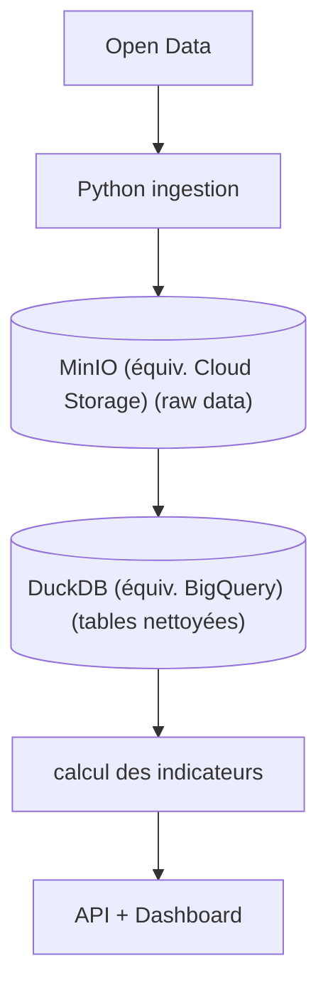

# 🏔️ Briançon Sustainable Tourism Observatory (BSTO)

> **Un pipeline de données dédié à l'analyse et à la promotion du tourisme durable dans la région de Briançon.**

Ce projet collecte, transforme et stocke des données liées aux flux touristiques, à l'impact environnemental et à l'économie locale pour aider à la prise de décision.

## 📽️ Vision : tourisme à capacité contrôlée (carrying capacity)
Créer une **plateforme publique de données territoriales** qui permet :
1. à la **mairie** de suivre la pression touristique
2. aux **habitants** de comprendre l'impact du toursime
3. aux **investisseurs touristiques** (gites, auberges, camping, etc.) de choisir des zones **sous-offertes**
4. de **répartir les flux touristiques** sans dépasser la capacité locale.

### Impact pour la mairie
#### décision publique
* limiter Airbnb dans les zones saturées
* encourager le toursime dans les villages voisins
  
#### urbanisme
* réguler les permis toursitiques
  
#### transition écologique
  * réduire la pression sur les écosystèmes
   
### Impact pour les investisseurs responsables
* identifier les zones **où créer un gîte sans nuire au territoire**
* comprendre la capaciré réelle d'accueil
* éviter la spéculation

## 🎯 Objectif du projet

Construire un **indice de pression touristique territoriale** pour chaque quartier ou village autour de Briançon.

Cet indice combine:
* capacité d'hébergement
* population locale
* fréquentation touristique
* mobilité
* accès aux services
* pression environnementale

Résultat:

Une **carte de recommandations d'investissement durable**.


---


## 🛠️ Stack Technique

* **Langage principal :** Python 🐍 / SQL 🗄️
* **Data Lake (Stockage Objet) :** MinIO 🛢️
* **Data Warehouse (Staging / Silver) :** PostgreSQL 🐘
* **Conteneurisation (Compute) :** Docker 🐳
* **Moteur Analytique (Gold / OLAP) :** DuckDB (équiv. BigQuery)🦆
* **Orchestrateur ETL (DAGs) :** Mage.ai ⏳

---

## 🏗️ Architecture du projet

1. **Extraction (Extract) :** Récupération des données open-data locales (météo, flux de transport, hébergements).
2. **Transformation (Transform) :** Nettoyage des données, gestion des valeurs manquantes et agrégation.
3. **Chargement (Load) :** Insertion dans le Data Warehouse pour l'analyse.


---

## 📂 Structure du Projet

```text
briancon-tourism-observatory/
├── 📄docker-compose.yml                 # Chef d'orchestre de l'infrastructure locale (Conteneurs MinIO, Postgres, Mage.ai)
├── 📄.gitignore                         # Fichier d'exclusion pour préserver la propreté et la sécurité du dépôt Git
├── 📄.env                               # Variables d'environnement et secrets locaux (Ignoré par Git)
├── 📄README.md                          # Documentation principale du projet
├── 📄requirements.txt                   # Liste des dépendances Python (pandas, minio, sqlalchemy, etc.)
├── 📁.vscode/                           # Paramètres locaux de l'éditeur VS Code et configuration SQLTools (Ignoré par Git)
├── 📁.venv/                             # Environnement virtuel Python (Ignoré par Git)
├── 📁scripts/                           # Scripts exécutables du pipeline ETL (Python)
│   ├── 📄bronze_extract_[domaine].py    # Extraction des données sources (API Open-Meteo, OSM, Geo) vers MinIO Bronze
│   ├── 📄silver_clean_[domaine].py      # Nettoyage et enrichissement : MinIO Bronze -> MinIO Silver + PostgreSQL
│   └── 📄gold_aggregate_[domaine].py    # Création des KPIs : PostgreSQL -> MinIO Gold (Parquet) + DuckDB
├── 📁data/                              # Volume Docker pour le Data Lake local (Ignoré par Git)
│   ├── 📁.minio.sys/                    # Fichiers système de MinIO
│   ├── 📁briancon-bronze/               # Zone Bronze : Données brutes (JSON) classées par domaine (weather/, parking/, population/)
│   ├── 📁briancon-silver/               # Zone Silver : Données nettoyées (JSON) classées par domaine
│   └── 📁briancon-gold/                 # Zone Gold : Données agrégées (Parquet) classées par domaine
├── 📁analytics/                         # Espace de travail analytique local (Ignoré par Git)
│   ├── 📁db/                            # Base de données OLAP locale (Fichier briancon.duckdb)
│   └── 📁temp_export/                   # Fichiers Parquet/CSV générés temporairement par les scripts Gold
├── 📁postgres_data/                     # Volume Docker persistant pour la base de données PostgreSQL (Ignoré par Git)
├── 📁mage_data/                         # Volume Docker persistant pour l'état interne de l'orchestrateur Mage.ai (Ignoré par Git)
└── 📁mage_project/                      # Configuration, blocs de code et DAGs des pipelines Mage.ai
```
---

## 🚀 Comment lancer le projet en local ?

**1. Cloner le dépôt et entrer dans le dossier**
```bash 
git clone git@github.com:salouatiq/BSTO.git
cd BSTO
```
**2. Configurer l'environnement local**
Créez un fichier nommé 📄.env à la racine du projet et ajoutez-y vos variables locales. Par exemple :
```bash 
MINIO_ENDPOINT=localhost:9000
MINIO_USER=user
MINIO_PASSWORD=mdp
```
**3. Lancer l'infrastructure (Docker)**
```bash
docker-compose up -d
```
**4. Préparer l'environnement Python (Pour le développement local)**
```bash
python -m venv .venv

# Sur Windows :
.venv\Scripts\activate
# Sur Mac/Linux : 
source .venv/bin/activate

pip install -r requirements.txt
```
**5. Exécuter le pipeline ETL complet**
Le pipeline est géré par l'orchestrateur Mage.ai.
* Ouvrez votre navigateur web et rendez-vous sur : http://localhost:6789
* Accédez au pipeline ``briancon_global_pipeline``
* Cliquez sur ``Run pipeline`` dans l'onglet ``Triggers`` pour lancer l'extraction parallèle des 3 piliers (Météo, Mobilité, Population et hébérgement).

---

## 👥 Auteur

* **Sofia AL OUATIQ** - *Data Engineer* - [Lien vers mon LinkedIn/GitHub]
